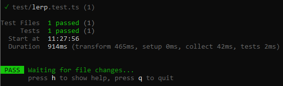

# 🧪 DevLab Testing Starter

This is my starter pack to quickly test the reliability of a function, feel free to use it.

## Usage

- Install dependencies :

```
yarn
```

- Add the file you want to test

- Create your test file &rarr; [Vitest](https://vitest.dev/guide/) for more infos.

- Run it :

```
yarn test
```

## Example

- File to test: /src/lerp.ts

```js
/**
 * Lerp - linear interpolation
 *
 * @param { number } x range start
 * @param { number } y range end
 * @param { number } a specified point
 *
 * @return { number } returns the value in a given range at a specified point
 */

const lerp = (x: number, y: number, a: number): number => {
  return x * (1 - a) + y * a;
};

export { lerp };
```

- Test file : /test/lerp.test.ts

```js
import { expect, test } from "vitest";

import { lerp } from "../src/lerp.js";

test("lerp()", () => {
  expect(lerp(0, 100, 0.5)).toBe(50);
  expect(lerp(20, 80, 0)).toBe(20);
  expect(lerp(30, 5, 1)).toBe(5);
  expect(lerp(-1, 1, 0.5)).toBe(0);
  expect(lerp(0.5, 1, 0.5)).toBe(0.75);
});
```

- Output :



## Setup

List of dependencies installed in the project:

- [Typescript](https://www.typescriptlang.org/) : Version 4.8.4
- [Vite](https://vitejs.dev/) : Version 3.1.7
- [Vitest](https://vitest.dev/) : Version 0.24.1

## Contact Me

- [Mail](mailto:hello@francois-royen.com)
- [LinkedIn](https://www.linkedin.com/in/francois-royen/)

## License

MIT, see [LICENSE](LICENSE) for details.
